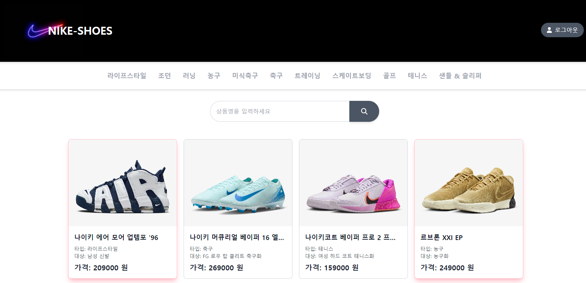
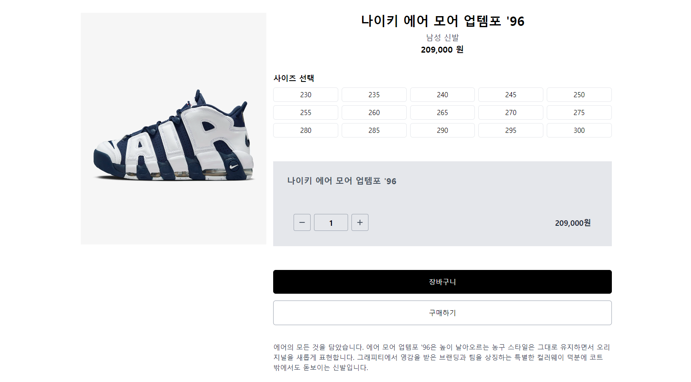

# 프로젝트 소개

나이키 신발 쇼핑몰 웹사이트입니다.

이 웹사이트는 사용자가 다양한 나이키 신발 상품을 조회하고, 상품의 상세 정보를 확인하며, 검색 기능을 통해 원하는 상품을 쉽게 찾을 수 있습니다.

## 데모 페이지

[여기에서 애플리케이션을 확인해보세요!](https://react-nike-shoes.vercel.app/)

## 기능

- **상품 조회 기능**: 다양한 나이키 신발 상품을 목록으로 조회할 수 있습니다.
- **상품 디테일 확인 기능**: 로그인이 된 경우, 상품의 상세 정보를 확인할 수 있습니다.
- **상품 검색 기능**: 사용자가 원하는 상품을 검색하여 쉽게 찾을 수 있습니다.
- **로그인 기능**: 사용자가 간단하게 로그인할 수 있는 기능을 제공합니다.

## 사용 기술

- React
- Tailwind CSS
- Axios
- json-server
- react-router-dom
